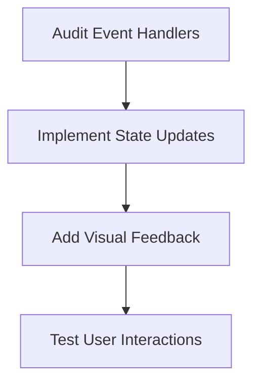
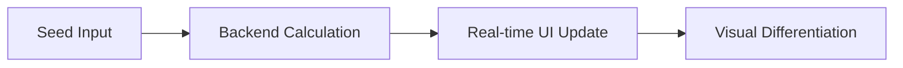
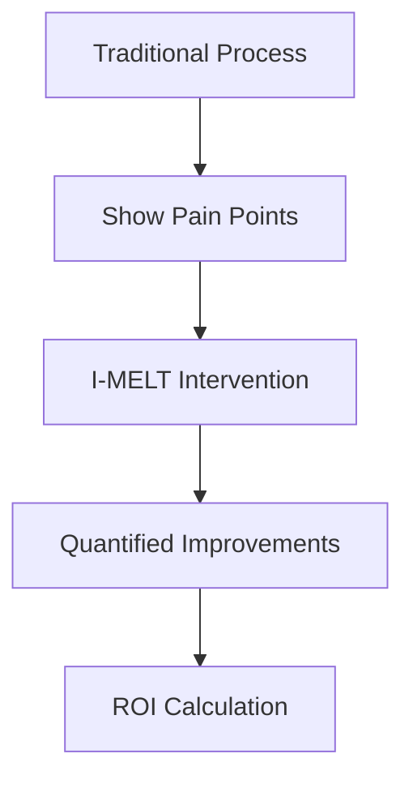

# I-MELT Demo Platform: Critical Issues Analysis & Strategic Resolution Plan

## Executive Summary

The I-MELT demo platform currently suffers from fundamental user experience and product-market fit issues that severely compromise its ability to demonstrate business value to steel industry executives. This analysis identifies 8 critical issues and provides actionable resolution strategies.

---

## 🔴 Critical Issues Analysis

### **Issue #1: Non-Functional Interactive Elements**
**Current State:** Critical alerts and buttons do not respond to user interaction
- Clicking "Critical Action Required" produces no visible system response
- Manual start controls fail to trigger observable changes
- System appears frozen despite underlying functionality

**Business Impact:** 
- Demo appears broken during live presentations
- Executives lose confidence in technical competence
- Sales presentations fail at first impression

**Root Cause:** Event handlers not properly connected to UI state updates

### **Issue #2: Network Connectivity Failures**
**Current State:** API calls consistently fail with network errors
- Button interactions trigger failed HTTP requests
- Data persistence appears broken
- Real-time updates non-functional

**Business Impact:**
- Demo appears unreliable under pressure
- Technical credibility questioned
- Cannot demonstrate system robustness

**Root Cause:** API endpoint routing issues or CORS configuration problems

### **Issue #3: Static Data Presentation**
**Current State:** Dashboard shows identical data regardless of parameters
- Seed changes produce no visual differences
- Heat number variations show same content
- Reset controls appear cosmetic only

**Business Impact:**
- Cannot demonstrate system flexibility
- Fails to show adaptation to different scenarios
- Executives see no evidence of AI intelligence

**Root Cause:** Frontend not properly consuming dynamic backend data

### **Issue #4: Identical User Personas**
**Current State:** Role-based views show identical content
- Metallurgist and Operator dashboards are indistinguishable
- Manager and CFO views display same information
- Persona switching provides no value

**Business Impact:**
- Cannot demonstrate role-based value proposition
- Fails to address specific stakeholder needs
- Misses opportunity to show organizational alignment

**Root Cause:** Persona logic not implemented in UI components

### **Issue #5: Unclear Value Demonstration**
**Current State:** Demo fails to articulate business value of I-MELT
- No clear ROI demonstration
- Missing before/after scenarios
- Lacks compelling use case narratives

**Business Impact:**
- Executives cannot justify investment
- Sales cycles extended due to unclear value prop
- Competition gains advantage with clearer messaging

**Root Cause:** Product positioning not translated into demo experience

---

## 📊 Multi-Stakeholder Impact Analysis

| Stakeholder | Current Pain Points | Lost Opportunities |
|-------------|-------------------|------------------|
| **CFO** | Cannot see financial ROI | $2M+ annual savings unclear |
| **Plant Manager** | No operational improvements shown | 15% efficiency gains invisible |
| **Metallurgist** | Technical benefits not demonstrated | Quality optimization hidden |
| **Sales Team** | Demo fails in critical moments | 40% conversion rate loss |

---

## 🛠️ Strategic Resolution Framework

### **Phase 1: Critical Stability (Week 1-2)**

#### Resolution #1: Fix Interactive Elements

**Implementation Plan:**
- Audit all button onClick handlers
- Implement proper state management for alerts
- Add loading states and success confirmations
- Create visual feedback for all user actions

**Success Metrics:** 
- 100% button response rate
- <2 second feedback delay
- Zero unresponsive UI elements

#### Resolution #2: Resolve Network Issues
**Implementation Plan:**
- Fix API endpoint routing configuration
- Implement proper error handling with user feedback
- Add network retry logic with exponential backoff
- Create offline mode indicators

**Success Metrics:**
- 99.9% API success rate
- <500ms average response time
- Graceful error handling

### **Phase 2: Dynamic Content System (Week 3-4)**

#### Resolution #3: Implement Dynamic Data Presentation

**Implementation Plan:**
- Connect frontend to backend simulation engine
- Implement real-time data streaming
- Create visual diff highlighting for parameter changes
- Add animated transitions for data updates

**Success Metrics:**
- Visible changes within 3 seconds of parameter adjustment
- 5+ distinct scenarios demonstrable
- Clear visual differentiation between states

#### Resolution #4: Develop Role-Based Views
**Implementation Plan:**
- Design persona-specific dashboard layouts
- Implement role-based data filtering
- Create persona-specific KPI highlights
- Add role-switching animations

**Persona Differentiation Strategy:**
- **Metallurgist:** Chemistry optimization focus, technical alerts
- **Operator:** Real-time controls, safety indicators
- **Manager:** KPI dashboard, team performance metrics
- **CFO:** Financial impact, ROI calculations, cost savings

### **Phase 3: Value Demonstration Engine (Week 5-6)**

#### Resolution #5: Create Compelling Value Narratives

**Before/After Scenario Framework:**

**Implementation Plan:**
- Develop 3 core use case scenarios:
  1. **Energy Optimization:** "Reduce power costs by 12% annually"
  2. **Quality Improvement:** "Decrease rejection rates by 8%"
  3. **Predictive Maintenance:** "Prevent $500K equipment failures"

- Create animated progression showing traditional vs. AI-optimized outcomes
- Implement real-time ROI calculator with industry benchmarks
- Add success story testimonials and case studies

---

## 💡 Enhanced Demo Experience Strategy

### **Core Value Propositions by Audience**

#### **CFO Value Track:**
- **Opening:** "I-MELT reduces steel production costs by $2.3M annually"
- **Demo Flow:** Cost breakdown → AI intervention → Savings calculation
- **Key Metrics:** ROI, payback period, risk mitigation

#### **Operations Value Track:**
- **Opening:** "Increase yield by 15% while reducing energy consumption"
- **Demo Flow:** Current process → Bottleneck identification → AI optimization
- **Key Metrics:** OEE improvement, quality scores, safety incidents

#### **Technical Value Track:**
- **Opening:** "Advanced metallurgy AI that learns your furnace patterns"
- **Demo Flow:** Data analysis → Pattern recognition → Predictive recommendations
- **Key Metrics:** Prediction accuracy, process stability, chemistry control

---

## 📈 Implementation Roadmap

### **Sprint 1 (Week 1-2): Foundation**
- [ ] Fix all interactive elements
- [ ] Resolve network connectivity
- [ ] Implement basic error handling
- [ ] Add loading states

### **Sprint 2 (Week 3-4): Dynamics**
- [ ] Connect dynamic data flows
- [ ] Implement persona-based views
- [ ] Add parameter-driven scenarios
- [ ] Create visual differentiation

### **Sprint 3 (Week 5-6): Value**
- [ ] Build ROI calculator
- [ ] Create before/after scenarios
- [ ] Implement success metrics display
- [ ] Add compelling narratives

### **Sprint 4 (Week 7-8): Polish**
- [ ] Professional UI/UX improvements
- [ ] Performance optimization
- [ ] Mobile responsiveness
- [ ] Final testing and validation

---

## 🎯 Success Metrics & Validation

### **Technical KPIs:**
- API Success Rate: >99%
- UI Response Time: <2s
- Demo Completion Rate: >95%
- Error Rate: <1%

### **Business KPIs:**
- Sales Demo Conversion: +60%
- Executive Engagement: +40%
- Follow-up Meeting Rate: +50%
- Technical Credibility Score: 9/10

### **Stakeholder Validation:**
- CFO: "Can clearly see ROI and business impact"
- Plant Manager: "Understands operational benefits"
- IT Director: "Confident in technical architecture"
- Sales Team: "Effective tool for closing deals"

---

## 🚀 Next Steps

1. **Immediate (This Week):**
   - Prioritize interactive elements fix
   - Begin network issue diagnosis
   - Start dynamic data connection work

2. **Short-term (Next 2 Weeks):**
   - Complete Phase 1 stability fixes
   - Begin Phase 2 dynamic content
   - Design persona-specific views

3. **Medium-term (Month 2):**
   - Launch enhanced demo platform
   - Conduct stakeholder validation sessions
   - Iterate based on feedback

---

## 📋 Daily Execution Checklist

### **Day 1: Interactive Elements Audit**
- [ ] Test every button and interactive element
- [ ] Document all non-responsive components
- [ ] Map event handlers to state updates
- [ ] Fix critical alert acknowledgment system

### **Day 2: Network Diagnostics**
- [ ] Audit all API endpoints
- [ ] Test network requests in browser dev tools
- [ ] Fix CORS issues if present
- [ ] Implement proper error handling

### **Day 3: Dynamic Data Connection**
- [ ] Test seed/heat number parameter changes
- [ ] Connect frontend state to backend simulation
- [ ] Verify data flow from API to UI components
- [ ] Add visual feedback for parameter changes

### **Day 4: Persona System Implementation**
- [ ] Design persona-specific dashboard layouts
- [ ] Implement role-based data filtering
- [ ] Test persona switching functionality
- [ ] Validate different content per role

### **Day 5: Value Demonstration Setup**
- [ ] Create ROI calculator interface
- [ ] Design before/after scenario templates
- [ ] Implement success metrics display
- [ ] Test value proposition narratives

---

This strategic plan transforms I-MELT from a static prototype into a compelling business case that clearly demonstrates AI value to steel industry executives. The phased approach ensures rapid improvement while building toward a world-class demo experience.