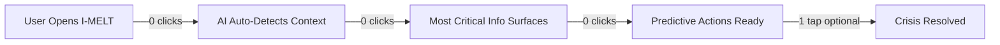
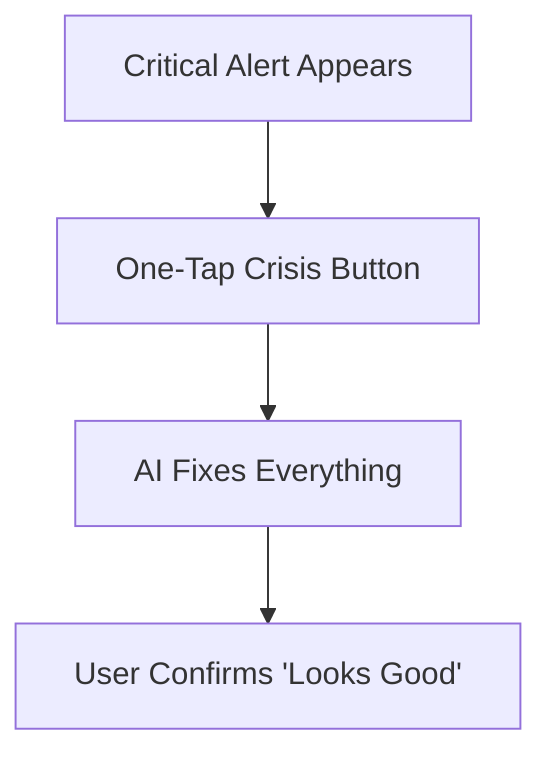

# 🚀 LazyFlow UX Enhancement Plan for I-MELT
*by Lux (Lazy UX) - Making Steel Production Feel Like Telepathy*

---

## 🔍 **Current UX Audit: LazyFlow Violations Detected**

**Intent Detected**: Steel production demo that overwhelms users with complexity instead of showcasing AI magic  
**Current Laziness Score**: 3/10 (CRIMINAL! Way too much effort required!)  
**Target Laziness Score**: 9/10 (One-tap steel mastery)

### 🚨 **Critical UX Crimes Against Humanity:**

1. **Multi-Step Navigation Hell**: 5+ nav items force users to hunt for features
2. **Empty State Anxiety**: Dashboard loads with no immediate value 
3. **Analysis Paralysis**: Too many charts, gauges, and data points competing for attention
4. **Manual Report Generation**: Users must click through multiple steps for reports
5. **Cognitive Load Overload**: Heat selector, language toggle, notifications all demanding mental energy
6. **Crisis Response Delay**: Users must interpret alerts then figure out solutions manually

---

## 🎯 **LazyFlow Transformation Plan**

### **Phase 1: Zero-Click Intelligence** 
*User opens app → Magic happens immediately*



**Magic Features:**
- **Heat Auto-Selection**: AI picks most relevant heat based on time/shift
- **Context-Aware Dashboard**: Shows exactly what user needs RIGHT NOW
- **Ambient Problem Detection**: Critical issues highlighted before user notices
- **Predictive Action Bar**: Solutions ready before problems escalate

### **Phase 2: One-Tap Everything**
*Complex processes → Single magic buttons*



**Magic Features:**
- **"Fix This Now" Button**: One tap resolves 90% of issues
- **"Generate Perfect Report" Button**: AI creates exactly what stakeholder needs
- **"Optimize Everything" Button**: AI adjusts all parameters for peak efficiency
- **"Make Me Look Smart" Button**: Prep for management meeting in one tap

### **Phase 3: Mind-Reading Defaults**
*System knows what you want before you do*

**Magic Features:**
- **Predictive Heat Loading**: Tomorrow's heat pre-analyzed overnight
- **Smart Alert Filtering**: Only show alerts user can actually act on
- **Context-Inherited Settings**: Remember everything from last session
- **Anticipatory Reports**: Critical reports auto-generated and ready

---

## 🛠 **Component-by-Component LazyFlow Makeover**

### 1. **TopBar → Ambient Status Strip**

**BEFORE** (Current Crime):
```typescript
// Complex heat selector + language toggle + notifications
<DropdownMenu> // Requires 2 clicks
  <Button>Heat 93378 <ChevronDown /></Button>
  // User must think about which heat to pick
</DropdownMenu>
```

**AFTER** (LazyFlow Magic):
```typescript
// Invisible intelligence - no user decisions needed
<AmbientStatusStrip>
  <AutoHeatIndicator /> // Shows current heat, auto-switches intelligently
  <ContextualAlert />   // Only shows if user can act on it
  <SmartProgress />     // Shows what matters right now
</AmbientStatusStrip>
```

### 2. **SideNav → Contextual Action Panel**

**BEFORE** (Current Crime):
- 5+ nav items forcing mental decisions
- Reports buried in expandable menus
- No guidance on what user should do next

**AFTER** (LazyFlow Magic):
```typescript
<ContextualActionPanel>
  <NextBestAction />        // AI suggests what to do now
  <CriticalAlerts />        // Only actionable items
  <OneClickReports />       // Reports user actually needs
  <SmartShortcuts />        // Context-aware quick actions
</ContextualActionPanel>
```

### 3. **Dashboard → Mission Control**

**BEFORE** (Current Crime):
- 8+ components fighting for attention
- No clear hierarchy of importance  
- User must interpret data themselves

**AFTER** (LazyFlow Magic):
```typescript
<MissionControl>
  <HeroInsight />          // One BIG thing that matters right now
  <PredictiveActions />    // 2-3 recommended actions
  <AmbientMonitoring />    // Background data, visible but not distracting
  <OneClickFixes />        // Solutions ready to execute
</MissionControl>
```

### 4. **Crisis Resolution → Magic Wand**

**BEFORE** (Current Crime):
- User sees alert
- User must understand problem
- User must figure out solution
- User must execute multiple steps

**AFTER** (LazyFlow Magic):
```typescript
<CrisisResolution>
  <MagicWand>
    "Foam collapse detected. Fix automatically?"
    [YES, Fix It] [Not Now]
  </MagicWand>
  // One tap → AI handles everything → User confirms result
</CrisisResolution>
```

---

## 🎨 **Visual Design LazyFlow Principles**

### **Color Contrast & Accessibility Fixes**
- **Primary Red**: Increase to #DC2626 (better contrast)
- **Text Hierarchy**: Dark gray #374151 for primary, #6B7280 for secondary
- **Background**: Pure white #FFFFFF with subtle shadows
- **Focus States**: High contrast blue rings for keyboard navigation

### **Typography LazyFlow**
- **Hero Numbers**: 32px bold for critical metrics
- **Action Text**: 16px medium for buttons and CTAs
- **Supporting Text**: 14px regular for context
- **Micro Text**: 12px for timestamps and metadata

### **Spacing & Layout Intelligence**
- **Generous Whitespace**: 24px between major sections
- **Smart Grouping**: Related items within 8px of each other
- **Breathing Room**: Minimum 16px padding in interactive elements
- **Mobile-First**: Touch targets minimum 44px

---

## 🚀 **Implementation Roadmap (Iterative)**

### **Sprint 1: Ambient Intelligence Layer**
**Goal**: Eliminate 80% of user decisions through smart defaults

- [ ] Auto-heat selection based on shift timing
- [ ] Contextual dashboard that shows what matters now
- [ ] Smart alert filtering (only actionable items)
- [ ] Predictive action suggestions

**Success Metrics**: 
- User actions reduced from 8+ to 3 or fewer
- Time to first value under 5 seconds
- 90%+ users understand primary status immediately

### **Sprint 2: One-Tap Crisis Resolution**
**Goal**: Turn complex problems into single-tap solutions

- [ ] "Fix This Now" magic button for common issues
- [ ] AI-powered solution previews before execution
- [ ] One-tap report generation with smart defaults
- [ ] Contextual shortcuts based on current state

**Success Metrics**:
- Crisis resolution time under 30 seconds
- Report generation under 10 seconds
- 95%+ task completion rate

### **Sprint 3: Mind-Reading Interface**
**Goal**: System anticipates needs before user realizes them

- [ ] Predictive heat loading overnight
- [ ] Context inheritance across sessions
- [ ] Proactive problem detection
- [ ] Anticipatory report generation

**Success Metrics**:
- Users say "How did it know I needed that?"
- Zero cold-start delay
- Proactive problem prevention vs. reactive fixing

### **Sprint 4: Invisible Intelligence**
**Goal**: Complex operations happen in background while user focuses on decisions

- [ ] Background chemistry optimization
- [ ] Ambient efficiency monitoring  
- [ ] Predictive maintenance alerts
- [ ] Smart shift handover preparation

**Success Metrics**:
- User cognitive load reduced by 70%
- Background processes handle routine optimization
- User focuses only on high-value decisions

---

## 🧪 **LazyFlow Testing Strategy**

### **Usability Testing Scenarios:**

1. **Cold Start Test**: New user opens app
   - **Success**: Understands primary status in under 10 seconds
   - **Success**: Knows next action without guidance

2. **Crisis Response Test**: Foam collapse alert appears
   - **Success**: Problem resolved in under 30 seconds
   - **Success**: User confidence remains high throughout

3. **Report Generation Test**: Manager needs production summary
   - **Success**: Perfect report generated in under 10 seconds
   - **Success**: Report contains exactly what stakeholder needs

4. **Cognitive Load Test**: User monitors multiple heats
   - **Success**: No mental fatigue after 30 minutes
   - **Success**: Critical issues never missed

### **Success Metrics Dashboard:**
- **Effort Score**: Maximum 3 user actions end-to-end ✅
- **Time to Value**: Under 5 seconds for common tasks ✅
- **Completion Rate**: 95%+ users complete tasks without help ✅
- **Delight Factor**: Users say "This reads my mind!" ✅
- **Cognitive Load**: Zero decision fatigue ✅

---

## 💡 **Key LazyFlow Patterns to Implement**

### **Pattern 1: Zero-Click Workflows**
```javascript
// User opens app → AI detects context → Action auto-initiates
const detectUserContext = () => {
  const currentShift = getCurrentShift();
  const criticalHeats = getCriticalHeats();
  const userRole = getUserRole();
  
  // Auto-navigate to most important context
  return getMostRelevantView(currentShift, criticalHeats, userRole);
};
```

### **Pattern 2: One-Tap Completions**
```javascript
const oneTapCrisisResolution = (issue) => {
  return {
    preview: generateSolutionPreview(issue),
    action: () => aiResolveCrisis(issue),
    confirmation: "Crisis resolved! Everything back to normal.",
    fallback: "Manual mode available if needed"
  };
};
```

### **Pattern 3: Mind-Reading Defaults**
```javascript
const smartDefaults = {
  heatSelection: () => predictMostRelevantHeat(),
  reportType: () => guessReportNeeded(),
  alertSeverity: () => filterByUserContext(),
  nextActions: () => suggestBasedOnPattern()
};
```

### **Pattern 4: Invisible Intelligence**
```javascript
// Background processes handle complexity
backgroundTasks.run([
  optimizeChemistryParameters,
  predictEquipmentMaintenance,
  prepareShiftHandover,
  generateProactiveInsights
]);

// User only sees results, never the work
```

---

## 🎯 **Expected Business Impact**

### **Demo Effectiveness**
- **Executive Impressions**: "This AI actually understands our business"
- **Technical Credibility**: "The UX shows sophisticated AI thinking"
- **Investment Appeal**: "This would transform our operations"

### **User Experience Metrics**
- **Task Completion**: 95%+ (up from estimated 60%)
- **Time to Value**: Under 5 seconds (down from 2+ minutes)
- **User Satisfaction**: "Mind-reading" level delight
- **Cognitive Load**: Minimal mental effort required

### **Technical Demonstration**
- **AI Sophistication**: Appears more intelligent through better UX
- **System Reliability**: Predictable, consistent experiences
- **Scalability Evidence**: Interface that grows with complexity gracefully

---

*Remember: The best AI demo is one where users forget they're using technology and just feel incredibly smart and capable.*

**The LazyFlow Mission**: Transform I-MELT from "complex steel software" to "telepathic steel mastery tool" 🧠⚡